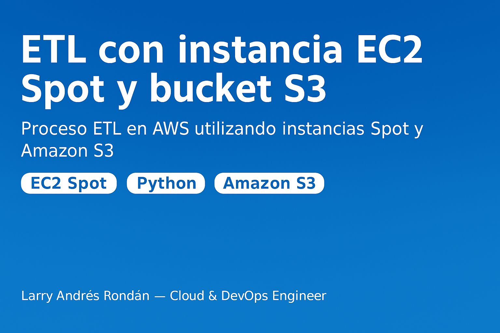

## 📘 Idiomas Disponibles
- 🇪🇸 [Versión en Español](README.md)
- 🇬🇧 [English Version](README_EN.md)

# ⚙️ ETL con instancia EC2 Spot y bucket S3  
Proceso ETL en AWS utilizando instancias Spot y Amazon S3

Este proyecto demuestra la ejecución de un proceso **ETL (Extract, Transform, Load)** utilizando una **instancia EC2 Spot** que procesa un archivo de entrada (`input_data.txt`) y genera un archivo transformado (`output_data.txt`) almacenado en un **bucket S3**.

Es una práctica real aplicable a entornos **Cloud y DevOps**, enfocada en automatización, uso eficiente de recursos y comprensión del flujo de trabajo ETL en la nube.

---

## 🎯 **Objetivo del Proyecto**
El objetivo es ejecutar un proceso ETL dentro de una instancia EC2 Spot que:

1. **Lee** un archivo de entrada.
2. **Transforma** su contenido.
3. **Genera** un archivo de salida.
4. **Lo almacena** automáticamente en un bucket S3.

Esto permite comprender:
- Flujo de procesamiento automático.
- Seguridad y permisos con IAM.
- Uso de instancias económicas (Spot).
- Integración entre EC2 + S3 mediante un rol IAM.
- Buenas prácticas de arquitectura Cloud.

---

## 🧩 **Servicios AWS Utilizados**

| Servicio | Función |
|---------|---------|
| **EC2 Spot** | Permite ejecutar cargas de trabajo de manera económica. |
| **IAM Role** | Autoriza a la instancia acceder al bucket S3. |
| **Amazon S3** | Almacena el archivo resultante del ETL. |
| **Python 3** | Lenguaje utilizado para el script ETL. |

---

## 🏗️ **Arquitectura General del Proyecto**

📄 **Imagen del flujo ETL:**  

**Flujo del Proceso:**

1️⃣ Usuario crea una instancia **EC2 Spot**  
2️⃣ La instancia contiene el archivo **input_data.txt**  
3️⃣ Se ejecuta el script **etl.py**  
4️⃣ El archivo transformado **output_data.txt** se guarda en S3  

---

# 🪜 **Paso a Paso del Proyecto (con evidencias)**

📁 Carpeta de evidencias: `docs/screenshots/`

---

### **1️⃣ Solicitud de flota Spot**
Se crea la solicitud de instancia Spot.

📸 **Evidencia:**  

---

### **2️⃣ Instancia Spot creada correctamente**
La instancia es aprovisionada y queda lista para conectarse.

📸 **Evidencia:**  

---

### 🟦 **3 Rol IAM con acceso a S3**

Se crea un **IAM Role** para que la instancia EC2 Spot pueda leer y escribir en el bucket S3.

📸 **Evidencia:**  

---

### 🟦 **4 Script ETL en Python**

Se desarrolla el script **`etl.py`**, el cual:

- Lee el archivo `input_data.txt`.
- Aplica una transformación simple al contenido.
- Genera el archivo `output_data.txt`.
- Lo envía automáticamente al bucket S3.

📸 **Evidencia:**  

---

### 🟦 **5 Conexión a la instancia y carga del archivo de entrada**

Se establece conexión a la instancia **EC2 Spot** y se copia el archivo `input_data.txt` para que sea procesado por el script ETL.

📸 **Evidencia:**  

---

### 🟦 **6 Verificación del script ETL en la instancia**

Se valida que el archivo `etl.py` esté correctamente ubicado en la instancia y listo para ejecutarse.

📸 **Evidencia:**  

---

### 🟦 **7 Ejecución del proceso ETL**

Se ejecuta el script `etl.py` en la instancia EC2 Spot, iniciando el procesamiento del archivo de entrada y generando el archivo de salida transformado.

📸 **Evidencia:**  

---

### 🟦 **8 Archivo procesado almacenado en S3**

Luego de ejecutarse el proceso ETL, el archivo `output_data.txt` es almacenado exitosamente en el bucket S3 definido.

📸 **Evidencia:**  

---

### 🟦 **9 Comparación entre archivo de entrada y salida**

Se realiza una comparación entre el archivo original (`input_data.txt`) y el archivo resultante (`output_data.txt`) para verificar que la transformación se haya ejecutado correctamente.

📸 **Evidencia:**  

---

## ✅ **Resultados Obtenidos**

- ✅ Se configuró exitosamente una instancia **EC2 Spot** con acceso a S3 mediante un rol IAM.
- ✅ Se ejecutó un **proceso ETL real en la nube**, desde lectura hasta almacenamiento.
- ✅ Se aplicó una **transformación** de datos y se verificó mediante comparación.
- ✅ Se utilizaron **servicios dentro del free tier**, optimizando costos.
- ✅ El proceso está **automatizado y replicable** como prueba de concepto para proyectos Cloud & DevOps.

---

## ✅ Checklist de validación rápida del ETL

- [x] Archivo **input_data.txt** subido a la instancia EC2 Spot  
- [x] Script **etl.py** ejecutado correctamente  
- [x] Archivo **output_data.txt** generado exitosamente  
- [x] Archivo de salida cargado en el bucket **S3**  
- [x] Permisos IAM correctamente asignados a la instancia  
- [x] Evidencias capturadas de todo el flujo (screenshots)

---

## 💵 Estimación de costos mensuales (uso puntual Spot + S3)

| Servicio | Costo aproximado USD/mes | Descripción |
|----------|--------------------------|-------------|
| **EC2 Spot (t2.micro)** | ~$0.60 - $1.50 | Ejecuciones puntuales de ETL (1–2 horas al mes). |
| **S3 (almacenamiento)** | ~$0.02 - $0.10 | Archivos de entrada y salida (~10–50 MB). |
| **IAM (rol)** | $0.00 | Uso gratuito de políticas de acceso. |

**💰 Total estimado:** | **~$1.00 / mes** | Proyecto educativo, optimizado para costos mínimos.

---

## 👨‍💻 Autor

**Larry Andrés Rondan Manrique**  
☁️ *Cloud & DevOps Engineer*

📬 **email:** larrycloudaws@gmail.com  
🐙 **GitHub:** [@larrycloud](https://github.com/larrycloud)  
🌐 **Portafolio en línea:** [https://devopscloud.click](https://devopscloud.click)
