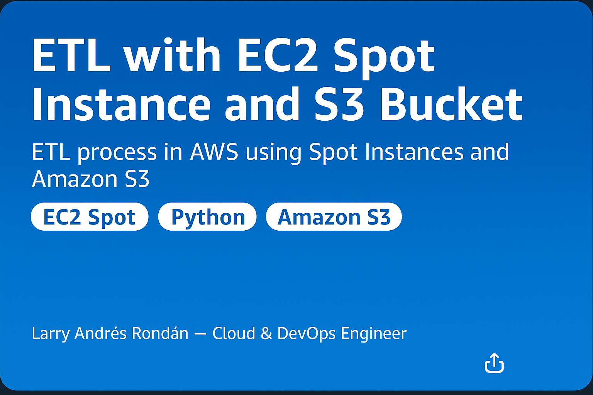
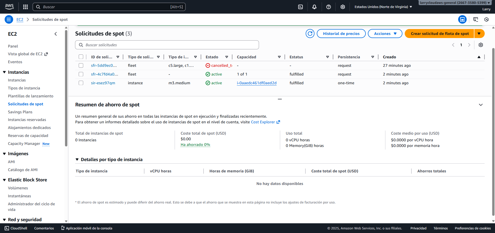
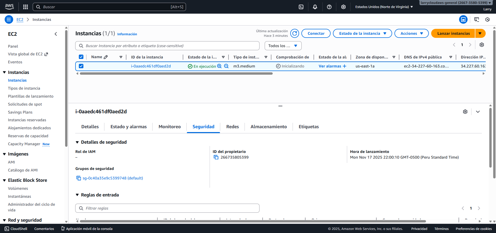
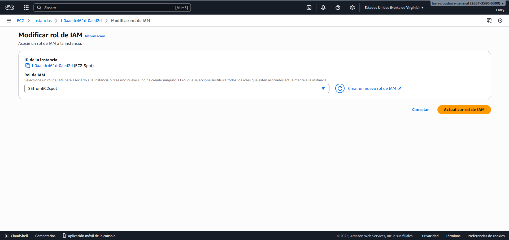
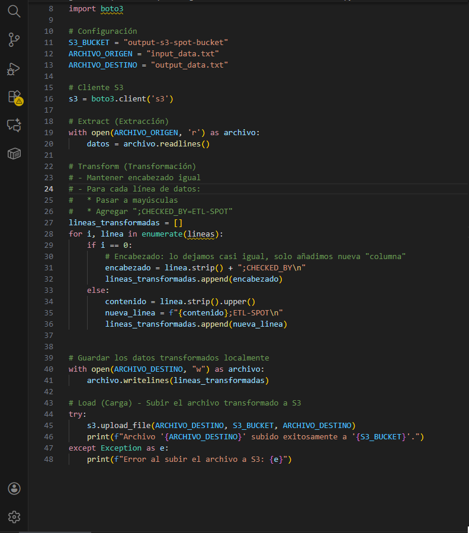
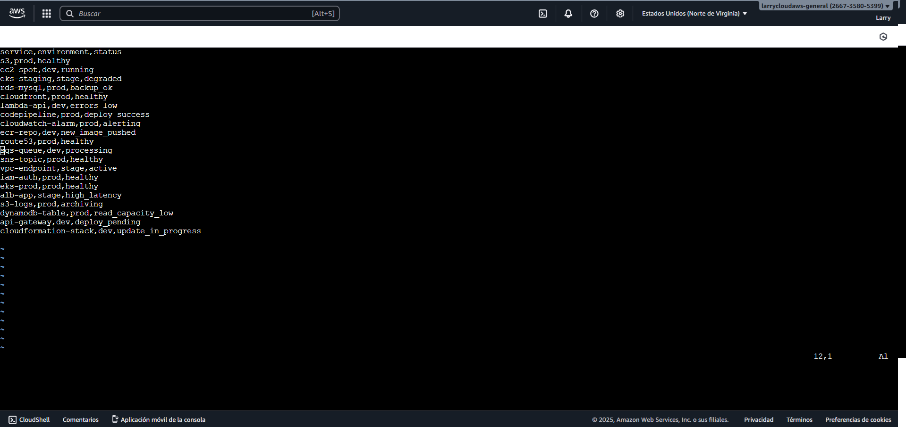
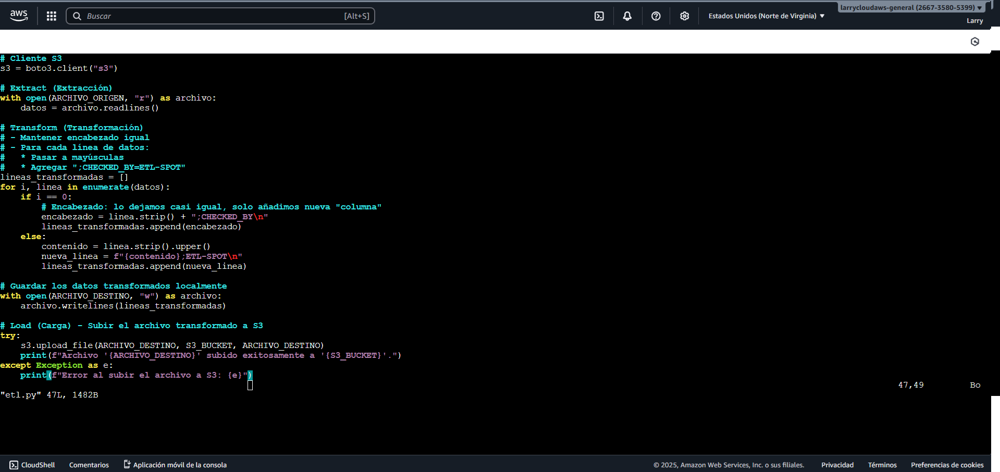
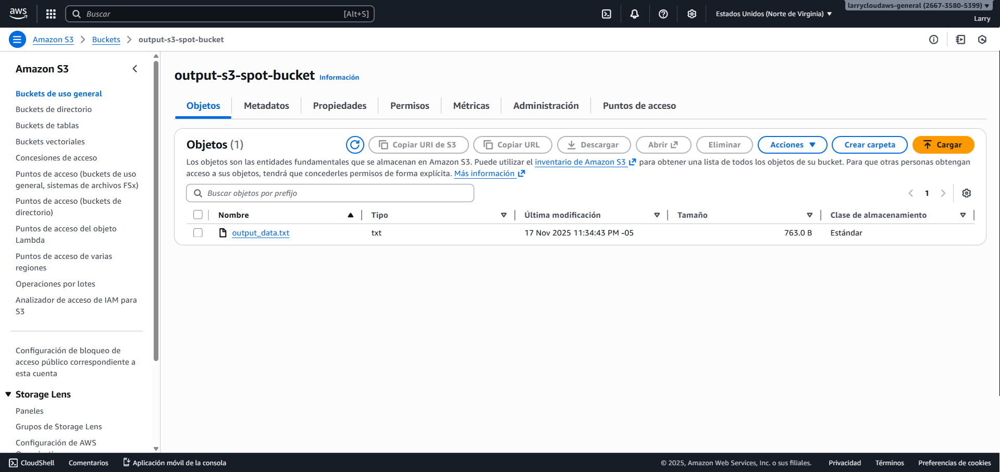
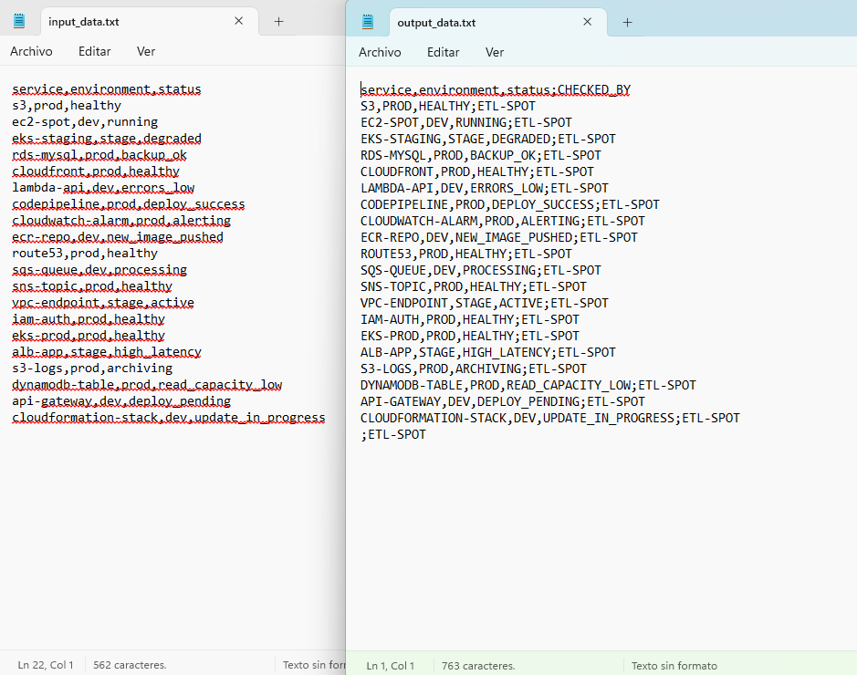

## 📘 Available Languages
- 🇪🇸 [Versión en Español](README.md)
- 🇬🇧 [English Version](README_EN.md)

# ⚙️ ETL with EC2 Spot Instance and S3 Bucket  
ETL process on AWS using EC2 Spot Instances and Amazon S3

This project demonstrates the execution of an **ETL (Extract, Transform, Load)** process using an **EC2 Spot instance** that processes an input file (`input_data.txt`) and generates a transformed file (`output_data.txt`) stored in a **S3 bucket**.

It is a real-world practice applicable to **Cloud and DevOps** environments, focused on automation, efficient resource usage, and understanding ETL workflows in the cloud.

---

## 🎯 **Project Objective**
The goal is to run an ETL process inside an EC2 Spot instance that:

1. **Reads** an input file.  
2. **Transforms** its content.  
3. **Generates** an output file.  
4. **Automatically stores it** in a S3 bucket.

This allows you to understand:
- Automated processing workflows.
- Security and IAM permission handling.
- Use of low-cost Spot instances.
- Integration of EC2 + S3 via IAM role.
- Cloud architecture best practices.

---

## 🧩 **AWS Services Used**

| Service | Purpose |
|---------|---------|
| **EC2 Spot** | Runs workloads in a cost-effective way. |
| **IAM Role** | Grants the instance access to the S3 bucket. |
| **Amazon S3** | Stores the resulting ETL output file. |
| **Python 3** | Used for scripting the ETL logic. |

---

## 🏗️ **Project Architecture Overview**

📄 **ETL Workflow Diagram:**  

**Workflow Steps:**

1️⃣ User launches an **EC2 Spot instance**  
2️⃣ The instance has the **input_data.txt** file  
3️⃣ The **etl.py** script is executed  
4️⃣ The transformed file **output_data.txt** is stored in S3  

---

# 🪜 **Step-by-Step Execution (with evidence)**

📁 Evidence folder: `docs/screenshots/`

---

### **1️⃣ Spot Fleet Request**
A Spot instance request is created.

📸 **Evidence:**  

---

### **2️⃣ EC2 Spot Instance Successfully Created**
The instance is provisioned and ready for connection.

📸 **Evidence:**  

---

### 🟦 **3 IAM Role with S3 Access**

An **IAM Role** is created to allow the EC2 Spot instance to read and write to the S3 bucket.

📸 **Evidence:**  

---

### 🟦 **4 Python ETL Script**

The **`etl.py`** script is developed to:

- Read the file `input_data.txt`.
- Apply a simple transformation to its contents.
- Generate the `output_data.txt` file.
- Automatically upload it to the S3 bucket.

📸 **Evidence:**  

---

### 🟦 **5 Connecting to the Instance & Uploading Input File**

A connection to the **EC2 Spot** instance is established and the input file `input_data.txt` is copied for processing.

📸 **Evidence:**  

---

### 🟦 **6 Verifying the ETL Script on the Instance**

The script `etl.py` is confirmed to be correctly located on the instance and ready to run.

📸 **Evidence:**  

---

### 🟦 **7 Running the ETL Process**

The `etl.py` script is executed inside the EC2 Spot instance to transform the input and generate the output file.

📸 **Evidence:**  

---

### 🟦 **8 Output File Stored in S3**

After the ETL runs, the resulting file `output_data.txt` is successfully uploaded to the designated S3 bucket.

📸 **Evidence:**  

---

### 🟦 **9 Input vs Output Comparison**

A comparison is made between `input_data.txt` and `output_data.txt` to validate that the transformation was correctly applied.

📸 **Evidence:**  

---

## ✅ **Key Outcomes**

- ✅ EC2 Spot instance successfully configured with IAM access to S3.
- ✅ A real **cloud-based ETL process** executed, from ingestion to storage.
- ✅ Transformation logic was implemented and verified.
- ✅ All components used are **within AWS Free Tier**.
- ✅ The workflow is **automated and replicable** for Cloud & DevOps portfolios.

---

## ✅ Quick Validation Checklist

- [x] **input_data.txt** uploaded to EC2 Spot instance  
- [x] **etl.py** script executed successfully  
- [x] **output_data.txt** generated correctly  
- [x] Output file uploaded to **S3**  
- [x] IAM Role permissions applied to instance  
- [x] Evidence collected for each step (screenshots)

---

## 💵 Estimated Monthly Costs (Spot + S3 usage only)

| Service | Approx. USD/month | Description |
|---------|-------------------|-------------|
| **EC2 Spot (t2.micro)** | ~$0.60 – $1.50 | For small-scale monthly ETL executions (1–2 hrs/month). |
| **S3 (storage)** | ~$0.02 – $0.10 | For small input/output files (~10–50 MB). |
| **IAM (role)** | $0.00 | Free for usage with policies. |

**💰 Estimated Total:** | **~$1.00 / month** | Educational setup with minimal cloud costs.

---

## 👨‍💻 Author

**Larry Andrés Rondan Manrique**  
☁️ *Cloud & DevOps Engineer*

📬 **Email:** larrycloudaws@gmail.com  
🐙 **GitHub:** [@larrycloud](https://github.com/larrycloud)  
🌐 **Portfolio:** [https://devopscloud.click](https://devopscloud.click)
